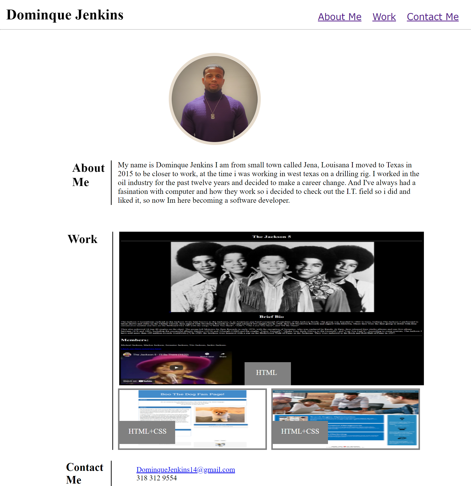

# My-Personal-Portfolio

This is my Portfolio I'm working to become a software developer so that was my motivation for this project among other things like continuing to develop new skill and it will also serve as a resume while also to keep up with my projects.

Things i learned while doing this project are positoning elements inline and block and how margin and width effect them and what you can do to get around that, but i would say positioning was the biggest challenge on this project.